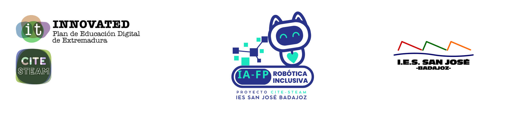

<div align="center">



# 🧠 TRIVIAL 2º ESO
### *Aprende jugando. Juega limpio.*

<br/>

> **Desarrollado con motivo del**
> # 🕊️ Día Mundial del Juego Limpio
> ### 19 de mayo de 2026
> *"El juego limpio no es solo una regla del deporte: es una forma de estar en el mundo."*

</div>

---

## 📖 ¿Qué es esto?

**Trivial 2.º ESO** es una aplicación web educativa de preguntas y respuestas generadas en tiempo real por Inteligencia Artificial, diseñada específicamente para el alumnado de **2.º curso de Educación Secundaria Obligatoria**.

Cada partida es única: la IA crea preguntas nuevas, adaptadas al nivel y a las materias seleccionadas, con explicaciones pedagógicas tras cada respuesta. No hay dos juegos iguales.

```
✅ Sin instalación    ✅ Sin registro    ✅ Funciona en cualquier navegador
```

---

## 🎯 Objetivos pedagógicos

El juego nace de una convicción sencilla: **aprender y jugar no son actividades opuestas**. Al contrario, el juego bien diseñado activa la motivación, reduce la ansiedad ante el error y refuerza la memoria a largo plazo.

Con este trivial buscamos:

- Repasar contenidos curriculares de forma lúdica y sin presión
- Fomentar la **curiosidad transversal** entre materias aparentemente distantes
- Normalizar el error como parte del proceso de aprendizaje
- Incorporar la IA como herramienta educativa de manera reflexiva y segura

---

## 🌐 Interdisciplinariedad

Una de las apuestas más importantes de este proyecto es romper los compartimentos estancos del conocimiento. El trivial combina en una misma sesión:

| Área | Materias incluidas |
|---|---|
| 🔢 Ciencias exactas | Matemáticas, Tecnología |
| 🌿 Ciencias naturales | Biología y Geología, Ciencias Naturales |
| 🌍 Ciencias sociales | Geografía, Historia |
| 📖 Humanidades | Lengua y Literatura, Inglés, Arte y Música |

Una misma partida puede llevar al alumnado de una ecuación a un poema, y de ahí a un río europeo o a una nota musical. Eso es pensar de forma **integrada**, que es como funciona el mundo real.

---

## 🕊️ Día Mundial del Juego Limpio — 19 de mayo

Este proyecto se publica coincidiendo con el **Día Mundial del Juego Limpio** (*World Fair Play Day*), promovido por el Comité Internacional por el Juego Limpio (CIFP) y reconocido por la UNESCO.

El juego limpio va mucho más allá del deporte: implica **respeto, honestidad, cooperación y responsabilidad** en cualquier actividad humana, incluida la educación. En este trivial lo entendemos así:

- 🤝 **Respeto** — cada pregunta incorrecta recibe una explicación, nunca una penalización humillante
- 💡 **Honestidad** — el alumno ve siempre la respuesta correcta y por qué lo es
- ⏱️ **Reto justo** — el temporizador es opcional; el juego se adapta, no presiona
- 🔒 **Privacidad** — no se recogen datos del alumnado. Ninguno.

---

## 🔒 Entorno seguro para menores

El diseño de esta aplicación ha tenido presente en todo momento que sus usuarias y usuarios son **menores de edad**. Por ello:

- **Sin cuentas, sin registros, sin perfiles.** El alumnado no introduce ningún dato personal para jugar.
- **Sin publicidad, sin rastreo, sin cookies de terceros.** La aplicación no conecta con ninguna plataforma de analítica ni publicidad.
- **Sin historial.** Las preguntas generadas no se almacenan en ningún servidor. Cada sesión es efímera.
- **Contenido generado con instrucciones explícitas de nivel y adecuación.** El modelo de IA recibe un prompt que especifica edad, nivel educativo y currículo español, lo que orienta el contenido generado hacia la idoneidad del curso.
- **La clave API queda en el dispositivo del docente**, nunca expuesta al alumnado.

> El uso de Inteligencia Artificial en este proyecto es **mediado por el profesorado**, no autónomo por parte del alumnado.

---

## ⚙️ Cómo funciona

```
Docente configura la sesión
        ↓
Selecciona materias + n.º preguntas + temporizador (opcional)
        ↓
La IA genera preguntas nuevas adaptadas al nivel 2.º ESO
        ↓
El alumnado responde → ve la respuesta correcta → lee la explicación
        ↓
Resumen final con todas las respuestas
```

La aplicación usa el modelo **Claude Sonnet** de [Anthropic](https://www.anthropic.com) para generar las preguntas. Cada llamada produce un JSON estructurado con pregunta, cuatro opciones, respuesta correcta y explicación pedagógica breve.

---

## 🚀 Uso

La aplicación es un único archivo `index.html`. No necesita servidor, ni framework, ni proceso de compilación.

**Para docentes — primera vez:**
1. Abre la URL de GitHub Pages del proyecto
2. Introduce tu clave API de Anthropic (`sk-ant-...`) — se guarda en el navegador
3. Selecciona materias, número de preguntas y si quieres temporizador
4. Pulsa **¡Jugar!** y comparte la pantalla con el grupo

**Para usar offline o en red local:**
1. Descarga `index.html`
2. Ábrelo directamente en cualquier navegador moderno
3. Necesita conexión a internet solo para llamar a la API

---

## 🏫 Contexto institucional

Este recurso forma parte del proyecto **IA-FP Robótica Inclusiva**, enmarcado en la iniciativa **CITE-STEAM** del **IES San José de Badajoz**, dentro del **Plan INNOVATED de Educación Digital de Extremadura**.

El proyecto CITE-STEAM explora la integración de la Inteligencia Artificial y la Robótica en entornos educativos inclusivos, con especial atención a la Formación Profesional y a la ESO.

---

## 👩‍💻 Autoría

<div align="center">

**Cristina Ramos García**
*Profesora de Matemáticas. ITED · IES San José, Badajoz*
*Coordinadora del proyecto CITE-STEAM*


© 2026 · Licencia [CC BY-NC-SA 4.0](https://creativecommons.org/licenses/by-nc-sa/4.0/deed.es)
*Puedes usar y adaptar este recurso con fines educativos no comerciales citando la autoría.*

</div>

---

<div align="center">
<sub>IES San José · Badajoz · 2026</sub>
</div>
